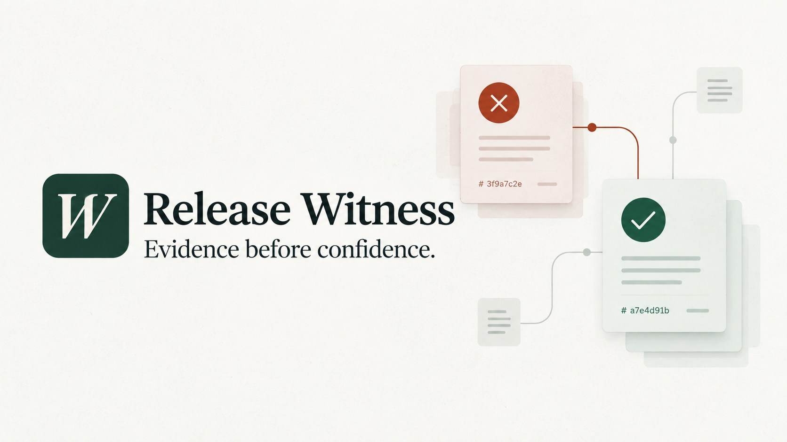

# Release Witness

[](https://github.com/K1Andayesh/release-witness/actions/workflows/ci.yml)
[](https://release-witness.139-99-135-89.sslip.io)
[](https://youtu.be/LVYa90poYM8)



A PR-preview QA agent that turns a change description into a bounded risk map, executes the same reviewed browser contract against a baseline and candidate, and compares the evidence. NVIDIA Nemotron through Nebius maps the change to every known check and chooses a constrained advisory next action; deterministic browser assertions own every verdict.

**Public competition demo:** https://release-witness.139-99-135-89.sslip.io

**Natural-narration demo video:** https://youtu.be/LVYa90poYM8

**Required runtime:** saved qualifying runs show `nvidia/Nemotron-3_5-Lightning` executing through Nebius Token Factory, including returned model identity, provider, latency and token usage. The hosted judge tour replays those verified records without requiring credentials or spending judge credits.

## Verified benchmark

Across two included ground-truth workflows, Release Witness detected **3/3 known defects (100%)** and correctly classified **3/3 repairs (100%)**, with **zero observed regressions**. It preserved three passing invariants, kept both excluded-coverage boundaries unverified and freshly verified all 16 screenshot hashes. The primary appointment pair also records the qualifying Nemotron runtime through Nebius. These figures describe the controlled included scenarios; they are not a claim about all production defects. See [`docs/EVALUATION.md`](docs/EVALUATION.md), the [model-backed appointment comparison](https://release-witness.139-99-135-89.sslip.io/#86f39150-bbd6-4039-b352-959da94e3097~75db5178-f87b-4d16-88e9-3e917f9a9a19) and the [independent Fieldnotes comparison](https://release-witness.139-99-135-89.sslip.io/#b417a60d-f983-4e66-b474-4ea86834c14e~9f67a852-c07e-444d-8d4c-dcc01302a2aa).

The competition case is mapped directly to the four equally weighted judging criteria in [`docs/JUDGING.md`](docs/JUDGING.md).

The [`architecture and trust-boundary map`](docs/ARCHITECTURE.md) shows the full path from change description and bounded Nemotron planning to isolated Chrome assertions, durable receipts and a freshly verified release comparison.

## Run

Requires Node.js 22+ and installed Google Chrome.

```powershell
npm ci
npm start
```

Open http://127.0.0.1:4317. Fresh checkouts need a local `.env` copied from `.env.example`. Without model credentials, uncheck Nemotron and run the browser suite independently. Never publish `.env` or local artifacts.

For a headless pass/fail check suitable for CI:

```powershell
npm run witness -- --suite booking-v1 --build candidate --change "Verify the repaired appointment candidate."
```

The command exits `0` only when every supported check passes, `1` for a failure or incomplete result, and `2` for invalid input or a runner error. Use `--help` for all options.

The default Harbour Appointments scenario has a baseline with two seeded defects and a repaired candidate. **Run baseline + candidate** executes the pair sequentially and opens the comparison automatically. Booking persistence and sold-out availability change from fail to pass; required-name validation remains passing; excluded coverage stays unverified. The candidate is supplied by the demo, not repaired automatically.

For judges, **Start 90-second tour** opens the strongest saved candidate and automatically compares it with the matching baseline. The competition evaluation detected both known baseline defects, preserved the passing invariant and classified both repairs correctly. The two model-enabled runs completed in 3.51 and 2.85 seconds. Each has a server-verified SHA-256 receipt covering report decisions, model provenance and every stored screenshot hash. See `docs/EVALUATION.md` for scope and evidence IDs.

Workflow definitions live in `manifests/`. They use a small allow-listed browser action language and may target included paths, explicit local HTTP preview URLs or read-only HTTPS pages. Add a validated JSON manifest and restart the server; runner code does not need a scenario-specific branch. See `docs/MANIFESTS.md`.

Saved JSON and screenshots survive restart under ignored `artifacts/runs/`. Completed runs receive a SHA-256 receipt; the server recomputes the report digest and reads every screenshot from disk before showing the verified badge. This proves internal artifact consistency, not who produced the files. View report opens readable Markdown text and includes the hashes; Download report requests a Markdown attachment.

## Verification

```powershell
npm run check
npm test
npm run format:check
```

Twenty contract/failure tests pass. Actual Chrome verification covers the server-managed paired-run workflow, judge-tour comparison restoration after reload, receipt verification and tamper detection, both appointment defects, the repaired candidate, before/after comparison, model-budget gating, model planning/advice, provider-failure fallback and public-demo restrictions. See `docs/QA.md`, `docs/DEMO.md` and `docs/READINESS.md`.

## Model and scope controls

The eligible model is `nvidia/Nemotron-3_5-Lightning`. Each model-enabled run uses two bounded calls: risk map then advice. The risk map must include every allow-listed check exactly once and a short hypothesis tied to its expected behavior. Every supported check still executes. Advisory choices cannot invent checks or alter browser outcomes. Invalid or unavailable model responses are displayed explicitly; the browser suite remains usable.

A persistent configurable development ledger, 1600 output-token limit per call, 45-second timeout and no retries bound use. Model-enabled runs require two remaining calls so a partial plan-only run cannot begin. The hosted demo disables live calls and presents saved verified model records; local operators set their own bounded allowance after reviewing provider access and budget. Standalone integration probes are separate from this ledger. It is not a live billing integration.

The server binds loopback. Mutating workflows may target only included paths or explicit `http://localhost`/`http://127.0.0.1` previews. Explicit HTTPS targets are accepted only when every action is read-only, and the runner blocks all origins except the Release Witness server and exact target origin. One server owns each artifact directory. This MVP has no authentication and is not prepared for public multi-user hosting.

The repository includes an MIT license, CI workflow, security guidance, a Devpost draft, a sub-three-minute demo script and a publication checklist. The bounded public demo is deployed on OVHcloud.

For a hosted competition test build, use the supplied `Dockerfile` and follow `docs/DEPLOYMENT.md`. Public demo mode disables model calls and hides saved runs, reports, comparisons, receipts, exports and evidence when their suite is not in the active public manifest catalog. It is suitable for the synthetic included scenarios; it is not a multi-tenant service for private projects.
