# Architecture and trust boundary

Release Witness separates model assistance, browser observation and release evidence so that no single probabilistic response can become a test verdict.

```mermaid
flowchart LR
  A[Change description] --> B[Validated workflow manifest]
  B --> C[Nemotron risk-map call<br/>Nebius Token Factory]
  C --> D[Strict plan validator<br/>all check IDs exactly once]
  D --> E[Isolated Chrome executor<br/>fresh context per check]
  E --> F[Deterministic assertions<br/>pass fail or not-tested]
  F --> G[Atomic report and screenshots]
  G --> H[Nemotron advisory call<br/>allow-listed next action]
  H --> I[SHA-256 evidence receipt]
  I --> J[Baseline/candidate comparison<br/>resolved regressed unchanged unverified]
  J --> K[Fresh receipt and screenshot verification]
  K --> L[Portfolio benchmark receipt<br/>aggregate SHA-256 digest]
```

## Authority by component

| Component          | May do                                                                                                         | Cannot do                                                       |
| ------------------ | -------------------------------------------------------------------------------------------------------------- | --------------------------------------------------------------- |
| Nemotron risk map  | Order every known check and attach a bounded hypothesis to each one                                            | Omit or invent checks, claim execution or set a verdict         |
| Manifest validator | Accept allow-listed browser actions, selectors and targets                                                     | Execute an unknown operation or silently widen coverage         |
| Chrome executor    | Navigate the approved target, perform the reviewed steps, capture screenshots and evaluate explicit assertions | Convert excluded coverage into a pass                           |
| Nemotron advisory  | Choose one server-provided next action and cite existing evidence IDs                                          | Invent work, mutate evidence or change a browser result         |
| Receipt verifier   | Recompute the report digest and read every referenced screenshot from disk                                     | Prove the identity of an external producer or application owner |
| Comparison engine  | Classify matching checks as resolved, regressed, unchanged or unverified                                       | Compare unrelated checks or treat `not-tested` as success       |

## Request and execution boundaries

- The change description is untrusted data inside the model prompt. It does not become an instruction to the runner.
- A model plan must contain every allow-listed check exactly once. Invalid, truncated or unavailable provider output falls back visibly to the standard reviewed order.
- Each check runs in a fresh Chrome context. Browser assertions, rather than model language, produce `pass` or `fail`.
- Mutating workflows are limited to included application paths and explicit loopback previews. Explicit HTTPS targets must use read-only actions, and the browser context blocks unrelated origins.
- Reports are written atomically. Completed runs receive a SHA-256 receipt over decisions, model provenance and screenshot hashes.
- A comparison request freshly verifies both receipts and reads every referenced screenshot before reporting that the pair is verified.
- The portfolio endpoint scores only manifest-declared ground truth and withholds the aggregate claim unless every latest workflow pair and screenshot receipt verifies.
- The benchmark report hashes a stable certification object containing the verified pair identities, scored states, totals and both run-receipt digests. Its timestamp and human-readable presentation remain outside the digest so repeated verification of unchanged evidence produces the same receipt.
- The hosted public demo disables live model spending and exposes only runs from the active public manifest catalog. The saved qualifying model records remain inspectable.

## Failure behavior

Provider authentication, rate-limit, timeout, identity, malformed-output and allowance failures remain visible while the deterministic browser suite stays usable. Browser interruption produces an incomplete report rather than a release pass. Missing, changed or unreceipted evidence fails verification.

This design keeps the model useful where judgment helps and keeps release claims tied to reproducible observations.
